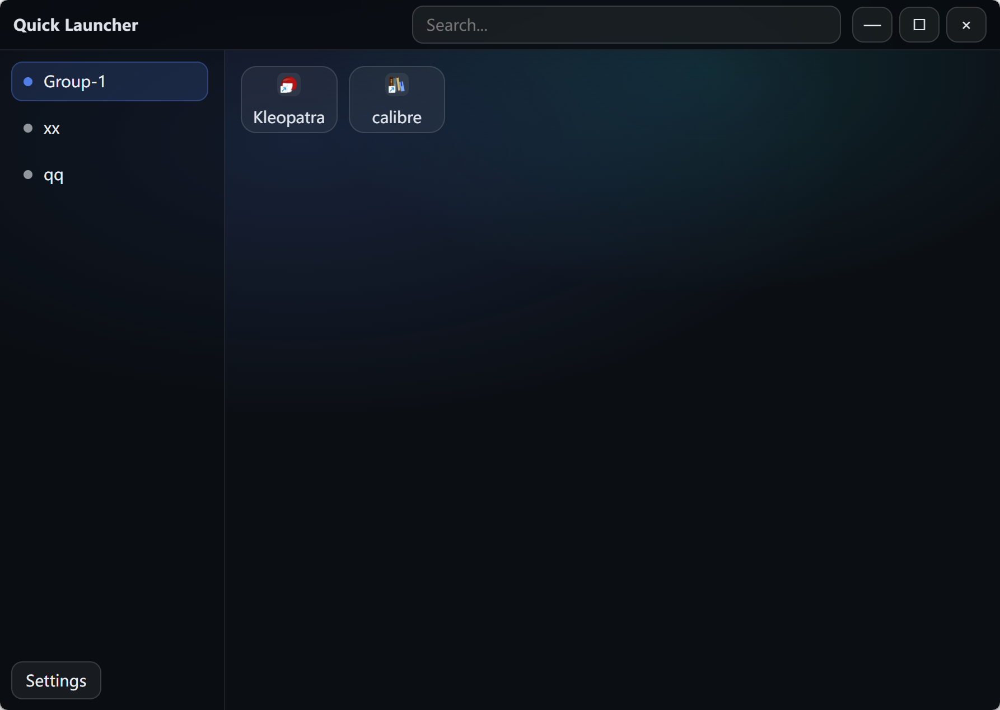

# Quick-Launcher

一个现代化、轻量级的 Windows 应用启动器，基于 Tauri 2 + Vue 3 + SQLite 构建。

> **说明**：这是 [heheda123123/my-quickstart](https://github.com/heheda123123/my-quickstart) 的重构版本，改进了架构并增强了功能。

## ✨ 功能特性

### 核心功能
- **多类型条目**：启动桌面应用、UWP 应用、URL、自定义脚本和内置系统操作
- **分组管理**：将应用组织到可自定义的分组中，支持拖拽排序
- **快速搜索**：跨所有分组搜索，支持关键词匹配
- **拖放添加**：通过拖拽文件到窗口来添加应用
- **右键菜单**：快速操作（编辑、打开文件夹、删除等）

### 自定义选项
- **主题**：深色/浅色模式支持
- **布局**：可调整卡片大小、侧边栏宽度和间距
- **字体**：自定义字体系列、大小和颜色
- **背景**：自定义背景图片，支持模糊和缩放控制
- **快捷键**：可配置的全局快捷键切换窗口显示

### 高级特性
- **管理员运行**：以提升权限启动应用程序
- **系统托盘**：最小化到托盘，快速访问菜单
- **开机自启**：系统启动时自动运行
- **窗口置顶**：保持窗口在其他应用之上
- **相对路径**：支持便携式安装
- **SQLite 存储**：快速、可靠的本地数据持久化

## 🖼️ 截图


*分组应用主界面*


*右键上下文菜单*

## 🚀 快速开始

### 前置要求
- Node.js 18+ 和 pnpm
- Rust 1.70+（用于 Tauri 开发）

### 开发

**仅前端**（无 Tauri 的 UI 预览）：
```bash
pnpm install
pnpm dev
```

**完整桌面应用**（含 Tauri）：
```bash
pnpm install
pnpm tauri dev
```

### 构建

为 Windows 构建（主要目标平台）：
```bash
pnpm install
pnpm tauri build --no-bundle
```

可执行文件将位于 `src-tauri/target/release/`。

## 📖 使用指南

### 基本操作
- **切换分组**：点击左侧边栏的分组标签
- **启动应用**：单击应用卡片
- **添加应用**：在空白处右键 → "添加应用"
- **添加分组**：在空白处右键 → "添加分组"
- **编辑应用**：在应用卡片上右键 → "编辑"
- **删除应用**：在应用卡片上右键 → "删除"
- **打开文件夹**：在应用卡片上右键 → "打开文件夹"

### 拖放操作
- 将 `.exe`、`.lnk` 或其他可执行文件拖入窗口即可添加
- 拖动应用卡片可在分组内重新排序
- 拖动分组可在侧边栏中重新排序（需在设置中启用）

### 键盘快捷键
- `Ctrl/Cmd + F`：聚焦搜索框
- `Esc`：清空搜索（搜索框聚焦时）
- 自定义全局快捷键：切换窗口显示（可在设置中配置）

### 特殊条目类型

**URL 条目**：在默认浏览器中打开网站
- 通过右键菜单中的"添加 URL"添加
- 前缀：`url:`

**脚本条目**：执行自定义脚本
- 通过右键菜单中的"添加脚本"添加
- 支持批处理脚本和 PowerShell
- 可以管理员权限运行
- 前缀：`script:`

**内置操作**：系统操作
- 关机、重启、睡眠、锁定等
- 通过右键菜单中的"内置项目"添加
- 前缀：`builtin:`

## 🏗️ 架构

### 技术栈
- **前端**：Vue 3 + TypeScript + Vite
- **后端**：Rust + Tauri 2
- **数据库**：SQLite（通过 rusqlite）
- **UI**：自定义 CSS，支持主题

### 项目结构
```
my-quickstart/
├── src/                      # Vue 前端
│   ├── components/           # Vue 组件
│   ├── launcher/             # 核心启动器逻辑
│   │   ├── types.ts          # TypeScript 类型定义
│   │   ├── storage.ts        # SQLite 接口
│   │   ├── customEntries.ts  # URL/脚本/内置支持
│   │   ├── useLauncherModel.ts # 主状态管理
│   │   └── ...               # 功能模块
│   └── App.vue               # 根组件
├── src-tauri/                # Rust 后端
│   ├── src/
│   │   ├── lib.rs            # 主 Tauri 命令
│   │   ├── icon.rs           # 图标提取和缓存
│   │   ├── uwp.rs            # UWP 应用支持
│   │   ├── hotkey.rs         # 全局快捷键处理
│   │   ├── storage.rs        # SQLite 操作
│   │   └── ...               # 其他模块
│   └── Cargo.toml            # Rust 依赖
└── package.json              # Node 依赖
```

### 核心模块

**前端**：
- `useLauncherModel`：中央状态管理和业务逻辑
- `storage`：通过 Tauri 命令的 SQLite 数据库接口
- `customEntries`：支持 URL、脚本和内置条目
- `cardDnd`：应用卡片的拖放功能
- `externalDrop`：处理外部文件拖放
- `i18n`：国际化（英文/中文）

**后端**：
- `icon`：提取和缓存应用程序图标（Windows API）
- `uwp`：枚举和启动 UWP 应用程序
- `hotkey`：注册全局键盘快捷键
- `storage`：SQLite 数据库操作
- `paths`：路径解析和验证

## 💾 数据存储

### 数据库位置
- Windows：`%APPDATA%\com.cat.quick-launcher\data\launcher.db`

### 数据库架构
- `groups`：分组定义
- `apps`：应用条目及元数据
- `settings`：用户偏好设置
- `icon_cache`：缓存的应用程序图标

## 🔧 配置

通过右上角的齿轮图标访问设置：

- **外观**：主题、颜色、字体、卡片大小
- **行为**：双击隐藏、窗口置顶、开机自启
- **快捷键**：切换窗口的全局快捷键
- **背景**：自定义背景图片及效果
- **高级**：相对路径、分组拖拽排序

## 🌍 国际化

支持的语言：
- 英文（en）
- 简体中文（zh-CN）

可在设置中更改语言。

## 🛠️ 开发说明

### 使用的 Tauri 插件
- `tauri-plugin-dialog`：文件/文件夹选择对话框
- `tauri-plugin-opener`：使用默认应用程序打开文件
- `tauri-plugin-global-shortcut`：全局快捷键注册
- `tauri-plugin-autostart`：系统启动时自动运行
- `tauri-plugin-single-instance`：防止多实例运行

### Windows 特定功能
- 从可执行文件提取图标
- UWP 应用程序枚举
- "以管理员身份运行"支持
- 文件操作的 Shell 集成

### 代码风格
- 前端：Vue 3 Composition API + TypeScript
- 后端：Rust 惯用写法
- 模块化设计，关注点分离

## 📝 许可证

本项目是重构的分支版本。许可证信息请参考原始仓库。

## 🙏 致谢

- 原始项目：[heheda123123/my-quickstart](https://github.com/heheda123123/my-quickstart)
- 使用 [Tauri](https://tauri.app/) 和 [Vue](https://vuejs.org/) 构建

## 🐛 已知问题

- 主要在 Windows 10/11 上测试
- macOS/Linux 支持处于实验阶段

## 🤝 贡献

欢迎贡献！请随时提交 issue 或 pull request。

## 🔄 重构改进

相比原始项目，本版本进行了以下改进：

### 架构优化
- 重构了状态管理逻辑，使用更清晰的模块化设计
- 改进了 TypeScript 类型定义，增强类型安全
- 优化了组件结构，提高代码可维护性

### 功能增强
- 增强了拖放功能的稳定性和用户体验
- 改进了图标缓存机制，提升性能
- 优化了搜索算法，支持更灵活的关键词匹配
- 增强了自定义背景功能，支持更多调整选项

### 用户体验
- 改进了 UI 响应速度
- 优化了动画效果和过渡
- 增强了错误处理和用户反馈
- 改进了设置界面的布局和可用性

### 代码质量
- 重构了核心逻辑，减少代码重复
- 改进了错误处理机制
- 增强了代码注释和文档
- 优化了性能关键路径
